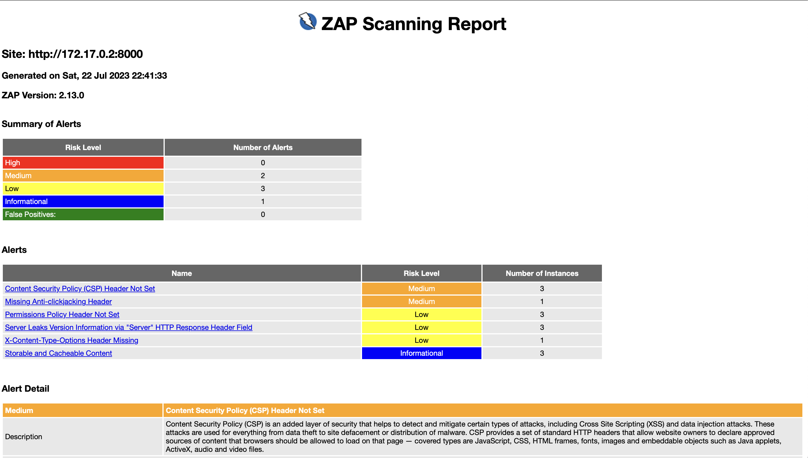
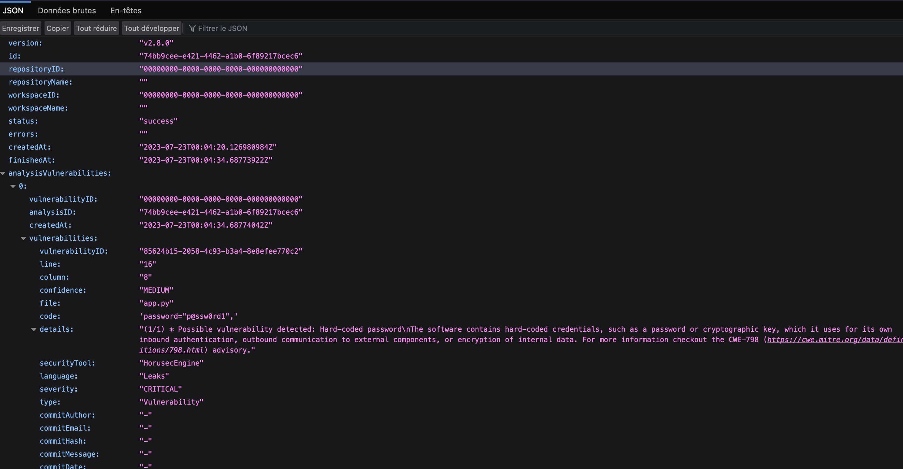
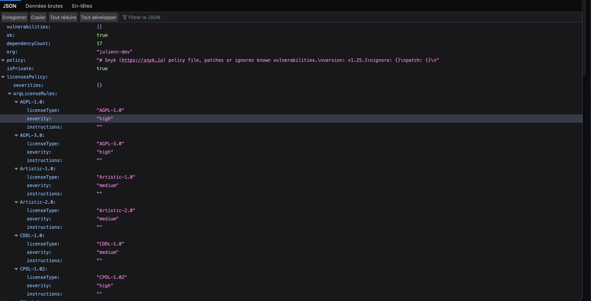

 

# Développement d'une pipeline CI/CD avec Github Actions

Ce README fournit des informations sur le projet en cours de création, qui vise à mettre en place une pipeline sécurisée GitHub Actions et Docker HUB. 
L'objectif principal est d'appliquer et de respecter les principes d'évaluation des vulnérabilités (scanning) tels que SAST (Static Application Security Testing), DAST (Dynamic Application Security Testing) et SCA (Software Composition Analysis) à l'aide de différents outils open source pour une web App Flask. Les vulnérabilités sont extraites via des rapports avec l'aide des Artifacts GIT. Vous trouverez un format JSON pour l'analyse SAST, SCA et un format HTML pour l'analyse DAST pour chaque commit sur la branche "Main Docker_pipeline".

Les rapports peuvent être récupérés et analysés ultérieurement via l'API GIT. 3 Artifacts

De plus, Le projet vise également à sécuriser les dépôts publics associés.

DAST : 

SAST : 

SCA : 

## Workflow:

Le workflow du projet comprend les étapes suivantes :

- Déploiement de l'environnement Docker : 
Création d'images Docker contenant tous les outils nécessaires pour effectuer les évaluations de sécurité. De la création des images pour l'APP (APP et DB) aux différentes images de scanning. Docker est configurée de manière sécurisée, avec des autorisations et des configurations appropriées.

- Configuration de GitHub Actions : 
Configuration des actions GitHub pour déclencher automatiquement le pipeline lorsqu'un événement spécifié se produit. Cela peut inclure des événements tels que les demandes de fusion (pull requests) sur la branch "Docker_pipeline".

- Analyse SAST (Static Application Security Testing) : 
  - Choix pour le projet : Horusec - Utilise des outils d'analyse statique pour détecter les vulnérabilités de sécurité potentielles dans le code source de l'application. Ces outils peuvent identifier des problèmes tels que des failles de sécurité connues, des pratiques de codage dangereuses, etc.

- Analyse DAST (Dynamic Application Security Testing) : 
  - Choix pour le projet : Owasp Zap - Effectue une analyse dynamique de l'application en exécutant des tests automatisés qui simulent des attaques réelles contre l'application. Cela permet de détecter les vulnérabilités qui peuvent être exploitées lors de l'exécution de l'application, telles que des injections SQL, des failles de cross-site scripting (XSS), etc.

- Analyse SCA (Software Composition Analysis) : 
  - Choix pour le projet : Snyk - Effectue une analyse des dépendances utilisées par l'application afin de détecter les composants logiciels avec des vulnérabilités connues. Cela garantit que les dépendances utilisées sont à jour et ne présentent pas de risques de sécurité.

- Déploiement de l'application Flask : 
  - Choix pour le projet : En cours d'implémentation - Utilise les outils de déploiement appropriés pour déployer l'application Flask dans l'environnement cible. L'environnement cible est en cours d'étude. Cela inclut la configuration des paramètres de l'application, l'installation des dépendances, la gestion des variables d'environnement, etc.

- Gestion des résultats : Configuration ldes actions GitHub pour notifier les développeurs des résultats de chaque analyse de sécurité.

## vulnérabilités détectées sur la pipeline :
- La pipeline actuelle n'est pas appropriée pour une utilisation en production car elle ne parvient pas à traiter les vulnérabilités détectées tout au long du processus. Afin de la rendre adaptée à une mise en production, il est essentiel d'effectuer un paramétrage plus avancé sur chaque job. De cette manière, la pipeline pourra répondre de manière adéquate aux vulnérabilités identifiées, en prenant des mesures telles que l'arrêt du processus en cas de vulnérabilité critique ou l'automatisation des correctifs pour les dépendances vulnérables.
Aussi, une pipeline en production ne doit en aucun cas pousser du code vers les serveurs de production si des vulnérabilités sont critiques présentes.  

## Comment récupérer les Rapports:
les étapes : 
- onglets "Actions" du projet
- Récupérer le dernier Workflow "CI/CD & Security Scan"
- Cliquer sur Artifacts

## Explications des Branch:
dockercompose/app_db :
- Cette branch du projet permet de déployer une application web avec une base de donnée via un fichier Docker Compose.

## CMD utils pour Docker
docker compose -f docker-compose.dev.yml up --build
Explication : 
- Cette commande permt de rouler les conteneurs mysqldb et l'application web via le paramétrage de l'environnement docker-compose. Le port exposé du conteneur est le 8000, il est accessible uniquement localement via "http://127.0.0.1:8000"

## Aide pour la réalisation du README et du projet
- Chatgpt 3.5
- stack overflow
- youtube
- git https://docs.github.com/fr